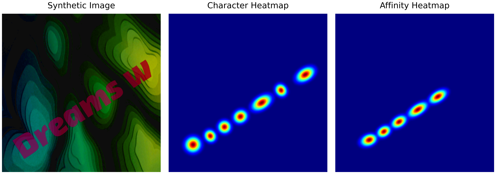

# Финальный проект курса Ингошколы DataScience по теме Optical Character Recognition (OCR)

## Описание проекта

В рамках учебного проекта выполнена задача разработки алгоритма детекции текста на изображении с использованием подхода CRAFT (Character-Region Awareness For Text Detection).

Проект состоит из следующих основных блоков этапов:
1. Генерация синтетических данных.
2. Дообучение `SegmentationTransformer` на основе созданных данных.
3. Настройка гиперпараметров для CRAFT.

---

## Этап 1: Генерация синтетических данных

На данном этапе требовалось разработать генератор синтетических данных, обеспечивая:
- ✅ разнообразие шрифтов и фоновых изображений;
- ✅ аугменатцию создаваемых изображений на уровне текстов, сегментационных масок, и изображения в целом;
- ✅ оптимизацию производительности, реализовав возможность параллельной генерации данных.

Для генерирования синтетических данных, необходимо выполнить:
```bash
python generate_images.py --num_images 5000 --save_folder syntdata
```

Процесс генерации и сохранения файлов выполняется параллельно с ожиданием `chunk_size` изображений, чтобы избежать переполнение оперативной памяти. Сама процедура генерации состоит из следующих этапов:
- создание, аугментация и ресайз случайного заднего фона изображения из 'static/backgrounds`;
- генерация триплетов `image`, `character_heatmap` и `affinity_heatmap` в которой используются случайные значения `color`, `font`, `text`, `opacity` и `size`, значения которых задаются в `static/constants.py`;
- изменение размеров триплетов и размещение их на background.

Все используемые для процесса генерации вспомогательные функции находятся в `generate_utils.py`.

Пример генерируемых синтетических данных:  




## Этап 2: Дообучение `SegmentationTransformer`

На данном этапе требовалось выполнить finetuning `SegmentationTransformer`, который включал следующие задачи:
- ✅ подбор правильной `Loss-function`;
- ✅ подбор гиперпараметров обучения;
- ✅ написание функции оценки качества детектирования текстов с вычислением метрик IoU (Intersection over Union) и F1-Score.

Запуск обучения модели можно осуществить выполнив следующую команду:
```bash
python train.py --input_dir syntdata --output_dir checkpoits --num_train_epochs 10 --caching True
```
Процесс обучения состоит из нескольких этапов, в том числе:
- создание модели на основе предобученной модели сегментации задача которой - предсказание character_heatmap и affinity_heatmap входящего изображения;
- определение loss-фунции;
- создание train и test датасетов синтетичесих данных;
- определение параметров обучения и запуск процесса обучения.

В качестве предобученной модели используется **`nvidia/segformer-b0-finetuned-ade-512-512`**. В качестве целевой лосс функции используется комбинированный **DiceFocalLoss**.  

Для ускорения процесса обучения, при формировании датасетов есть возможность кешировать всю необходимую предобработку до цикла обучения, установив параметр `--caching True` *(осторожно, это может съесть всю RAM)*. Кеширование объектов также осуществляется с использованием параллелизации, что даёт хороший прирост к скорости кеширования при условии высокой скорости считывания данных с носителя.  

Основные параметры обучения, такие как `batch_size`, `learning_rate`, определены в `train.py`. Метрики обучения приведены в `PipelineFinalProject.ipynb`

## Этап 3: Настройка гиперпараметров для CRAFT

На данном этапе требовалось выполнить оптимизацию гиперпараметров алгоритма CRAFT для детектирования тектов на изображении. Требования к оптимизации:
- ✅ применение библиотеки **`Optuna`**;
- ✅ оптимизация на основе метрик качества IoU и F1-Score.

Для оптимизации гиперпараметров алгоритма CRAFT используется оптимизатор `optuna`, а в качестве оптимизируемых параметров аргументы функции **`craft_utils.getDetBoxes`**, а именно `text_threshold`, `link_threshold` и `low_text`.

Выполнение оптимизации использует функцию расчёта метрики `train_utils.compute_metrics()` для максимизации IoU и F1-Score. Пример выполения приведён в `PipelineFinalProject.ipynb`

---

Пример выполнения каждого из этапов приведён в ноутбуке **`!PipelineFinalProject.ipynb`**, в том числе примеры инференса модели.

Выделив ещё время на проект я выполню:
- улучшение генератора синтетических данных: создание текстов по направляющим кривым, эластичные изменения текстов и более умное расположение их на фоновом изображении
- поиск char-level OCR датасетов реальных данных для формирования `character_heatmap` и `affinity_heatmap` и добавления таких датасетов в обучающую выборку;
- использование word-level OCR датасетов для обучения модели, которая будет предсказывать `character_heatmap` и `affinity_heatmap` для текстов внутри bbox-ов, что потом буду использовать для формирования новых реальных обучающих данных.


